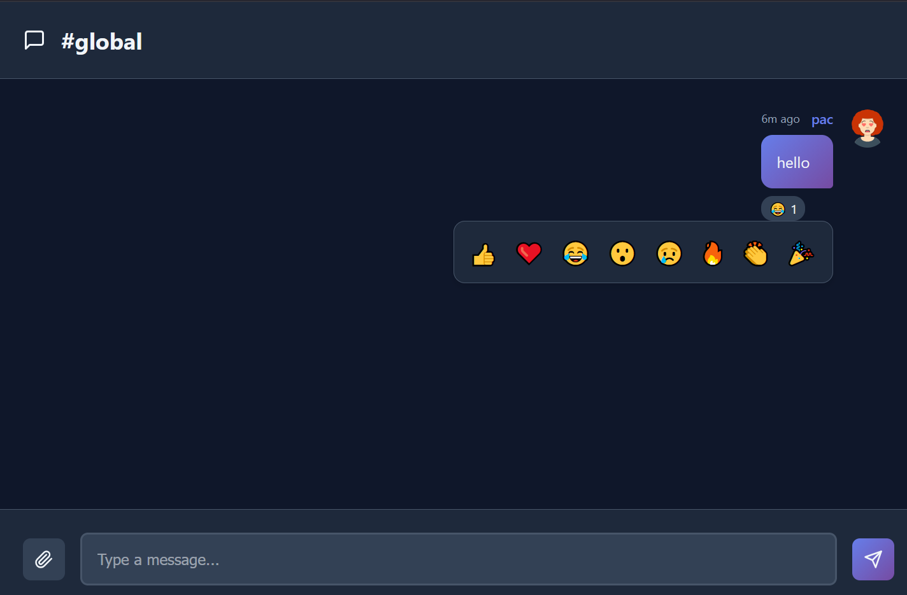

# Real-Time Chat Application with Socket.IO

[](https://your-deployment-link.com)

A full-stack real-time chat application built with the MERN stack (MongoDB, Express.js, React, Node.js) and Socket.IO for instant messaging and live updates.

## 📸 Screenshots

### Login Page

*User authentication interface with email and password fields*

### Chat Interface

*Main chat interface showing real-time messaging and user list*

### Room Creation

*Modal for creating new chat rooms*

### Mobile Responsive

*Responsive design optimized for mobile devices*

### Emoji Reactions

*Interactive emoji reactions on messages*

## 🚀 Features

- **Real-time messaging** with instant delivery
- **User authentication** (register/login)
- **Multiple chat rooms** with room creation and joining
- **Emoji reactions** on messages
- **Typing indicators** to show when users are typing
- **Online/offline status** of users
- **File sharing** support (images and documents)
- **Responsive design** for mobile and desktop
- **Browser notifications** for new messages
- **Message history** with pagination

## 🛠️ Tech Stack

### Frontend
- **React 18** - Modern React with hooks
- **Vite** - Fast build tool and dev server
- **Socket.IO Client** - Real-time communication
- **React Router** - Client-side routing
- **React Hot Toast** - Toast notifications
- **Lucide React** - Beautiful icons
- **Axios** - HTTP client

### Backend
- **Node.js** - JavaScript runtime
- **Express.js** - Web framework
- **Socket.IO** - Real-time bidirectional communication
- **MongoDB** - NoSQL database
- **Mongoose** - MongoDB object modeling
- **JWT** - JSON Web Tokens for authentication
- **bcryptjs** - Password hashing
- **Multer** - File upload handling
- **CORS** - Cross-origin resource sharing

## 📁 Project Structure

```
real-time-communication-with-socket-io/
├── client/                 # React frontend
│   ├── public/
│   ├── src/
│   │   ├── components/     # Reusable UI components
│   │   │   ├── Auth/       # Login/Register components
│   │   │   ├── Chat/       # Chat-related components
│   │   │   └── Sidebar/    # Sidebar components
│   │   ├── context/        # React context providers
│   │   ├── hooks/          # Custom React hooks
│   │   ├── pages/          # Page components
│   │   ├── socket/         # Socket.IO client setup
│   │   └── utils/          # Utility functions
│   ├── package.json
│   └── vite.config.js
├── server/                 # Node.js backend
│   ├── config/             # Configuration files
│   ├── controllers/        # Route controllers
│   ├── models/             # MongoDB models
│   ├── socket/             # Socket.IO handlers
│   ├── utils/              # Utility functions
│   ├── uploads/            # File uploads directory
│   ├── package.json
│   └── server.js
├── .env.example            # Environment variables template
├── .gitignore             # Git ignore rules
└── README.md              # Project documentation
```

## 🚀 Getting Started

### Prerequisites

- **Node.js** (v16 or higher)
- **MongoDB** (local installation or MongoDB Atlas)
- **npm** or **yarn** package manager

### Installation

1. **Clone the repository**
   ```bash
   git clone <repository-url>
   cd real-time-communication-with-socket-io
   ```

2. **Set up the backend**
   ```bash
   cd server
   npm install
   ```

3. **Set up the frontend**
   ```bash
   cd ../client
   npm install
   ```

4. **Environment Configuration**

   Copy the `.env.example` file to `.env` in the server directory and fill in your configuration:

   ```bash
   cd ../server
   cp .env.example .env
   ```

   Edit the `.env` file with your actual values:
   ```env
   MONGODB_URI=mongodb://localhost:27017/chatapp
   JWT_SECRET=your-super-secret-jwt-key
   PORT=5000
   CLIENT_URL=http://localhost:5173
   ```

5. **Start the development servers**

   **Terminal 1 - Backend:**
   ```bash
   cd server
   npm run dev
   ```

   **Terminal 2 - Frontend:**
   ```bash
   cd client
   npm run dev
   ```

6. **Open your browser**

   Navigate to `http://localhost:5173` to access the application.

## 🔧 Available Scripts

### Backend (server/)
```bash
npm run dev      # Start development server with nodemon
npm start        # Start production server
npm test         # Run tests (not implemented)
```

### Frontend (client/)
```bash
npm run dev      # Start development server
npm run build    # Build for production
npm run preview  # Preview production build
npm test         # Run tests (not implemented)
```

## 🔐 Authentication

The application uses JWT (JSON Web Tokens) for authentication:

- **Registration**: Create a new account with username, email, and password
- **Login**: Authenticate with email and password
- **Token-based**: Secure API endpoints and socket connections

## 💬 Socket.IO Events

### Authentication Events
- `auth:register` - Register a new user
- `auth:login` - Login existing user

### Message Events
- `message:send` - Send a new message
- `message:get` - Retrieve message history
- `message:read` - Mark message as read
- `message:reaction` - Add emoji reaction to message
- `message:new` - Receive new message (broadcast)
- `message:reaction:update` - Receive reaction update (broadcast)

### Room Events
- `room:create` - Create a new chat room
- `room:get` - Get list of available rooms
- `room:join` - Join a chat room
- `room:created` - Room creation notification (broadcast)
- `room:user:joined` - User joined room notification (broadcast)

### User Status Events
- `user:online` - User came online (broadcast)
- `user:offline` - User went offline (broadcast)
- `users:online` - List of online users

### Typing Events
- `typing:start` - User started typing
- `typing:stop` - User stopped typing
- `typing:user` - Typing status update (broadcast)

## 📱 API Endpoints

### File Upload
- `POST /api/upload` - Upload files (images/documents)

### Health Check
- `GET /api/health` - Server health status

## 🔒 Security Features

- **Password hashing** with bcryptjs
- **JWT authentication** for secure API access
- **CORS protection** with configured origins
- **Input validation** and sanitization
- **File upload restrictions** (size and type limits)

## 🎨 UI/UX Features

- **Responsive design** - Works on mobile and desktop
- **Dark/light theme support** (expandable)
- **Toast notifications** for user feedback
- **Loading states** and error handling
- **Real-time updates** without page refresh
- **Browser notifications** for new messages
- **Typing indicators** for better UX

## 🚀 Deployment

### Quick Deploy to Vercel (Recommended)

#### Prerequisites
- [Vercel Account](https://vercel.com)
- [MongoDB Atlas](https://www.mongodb.com/atlas) or another MongoDB provider

#### Deploy Steps

1. **Fork/Clone this repository to GitHub**

2. **Deploy Backend to Vercel:**
   ```bash
   # Install Vercel CLI
   npm install -g vercel

   # Deploy backend
   cd server
   vercel --prod

   # Set environment variables in Vercel dashboard:
   # MONGODB_URI, JWT_SECRET, CLIENT_URL, NODE_ENV=production
   ```

3. **Deploy Frontend to Vercel:**
   ```bash
   # Deploy frontend
   cd ../client
   vercel --prod

   # Set environment variable in Vercel dashboard:
   # VITE_API_URL=https://your-backend-url.vercel.app
   ```

4. **Update Environment Variables:**
   - In your backend Vercel project: Set `CLIENT_URL` to your frontend Vercel URL
   - In your frontend Vercel project: Set `VITE_API_URL` to your backend Vercel URL

### Alternative Deployment Options

#### Backend Deployment
1. Set production environment variables
2. Run `npm start` instead of `npm run dev`
3. Use a process manager like PM2 in production

#### Frontend Deployment
1. Build the application: `npm run build`
2. Serve the `dist` folder with a static server
3. Configure your web server (nginx, Apache) to serve the built files

### Environment Variables for Production
```env
NODE_ENV=production
MONGODB_URI=your-production-mongodb-uri
JWT_SECRET=your-production-jwt-secret
PORT=5000
CLIENT_URL=https://your-frontend-domain.com
VITE_API_URL=https://your-backend-domain.com
```

## 🤝 Contributing

1. Fork the repository
2. Create a feature branch (`git checkout -b feature/amazing-feature`)
3. Commit your changes (`git commit -m 'Add amazing feature'`)
4. Push to the branch (`git push origin feature/amazing-feature`)
5. Open a Pull Request

## 📝 License

This project is licensed under the ISC License - see the [LICENSE](LICENSE) file for details.

## 🙏 Acknowledgments

- [Socket.IO](https://socket.io/) for real-time communication
- [React](https://reactjs.org/) for the frontend framework
- [MongoDB](https://www.mongodb.com/) for the database
- [Express.js](https://expressjs.com/) for the backend framework

## 📞 Support

If you have any questions or issues, please open an issue on GitHub or contact the development team.

---

**Happy chatting! 🎉**
